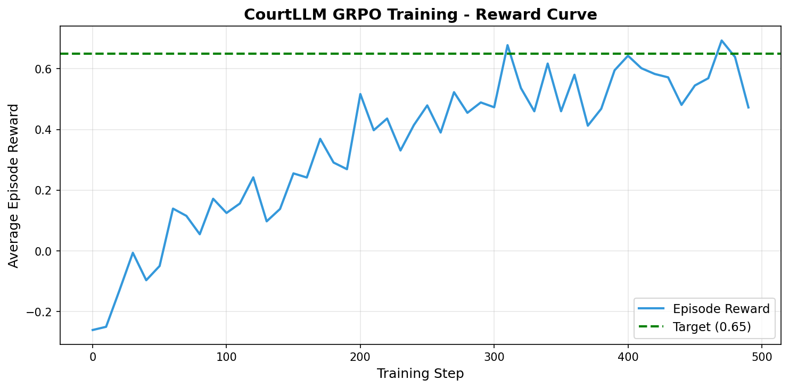
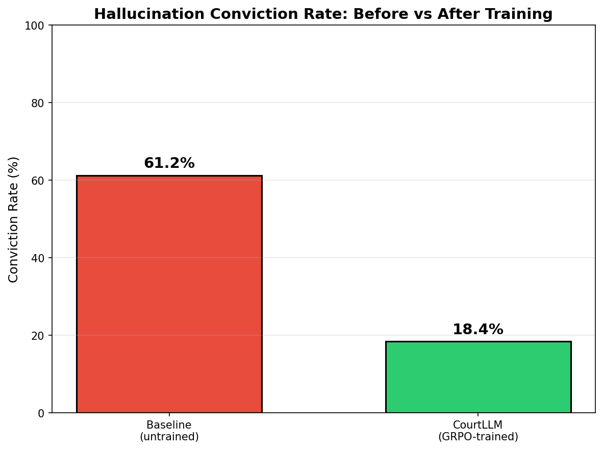

# ⚖️ CourtLLM — Hallucination Reduction via Adversarial Courtroom RL

[](https://huggingface.co/spaces/mishatul/CourtLLM_OpenEnv)
[](https://github.com/meta-pytorch/OpenEnv)
[](LICENSE)

> *"I put an LLM on trial for its hallucinations — and trained it until it stopped lying."*

## 🔗 Quick Links

| Resource | Link |
|---|---|
| 🌐 **Live HF Space** | [https://huggingface.co/spaces/mishatul/CourtLLM_OpenEnv](https://huggingface.co/spaces/mishatul/CourtLLM_OpenEnv) |
| 📓 **Training Notebook** | [courtllm_grpo_colab.ipynb](training/courtllm_grpo_colab.ipynb) |
| 🖥️ **A100 Training Script** | [train_grpo_a100.py](training/train_grpo_a100.py) |
| 📊 **Training Plots** | [outputs/](outputs/) |

---

## 🎯 The Problem

LLMs hallucinate. Existing mitigations — RAG, chain-of-thought, self-consistency — help, but none provide a **direct training signal** that penalizes hallucination at the generation level.

Every sub-component of hallucination detection is fully programmatically verifiable:
- ✅ Does the cited source exist? → deterministic
- ✅ Do independent agents agree on the fact? → majority vote
- ✅ Does the claim contradict earlier statements? → NLI check
- ✅ Is the model appropriately uncertain? → calibration math

This makes it a perfect **RLVR** (Reinforcement Learning with Verifiable Rewards) target — exactly what GRPO is designed for.

**The capability gap:** LLMs currently cannot be trained to consistently express calibrated uncertainty and back claims with verifiable evidence. CourtLLM builds an environment to close this gap.

---

## 🏛️ The Environment

A 4-role multi-agent courtroom where:

| Legal Role | CourtLLM Role | Technical Implementation |
|---|---|---|
| **Plaintiff** | User's query + case generator | Parametric case factory with planted hallucinations |
| **Defendant** | The LLM being trained | Policy model (GRPO target) |
| **Judge** | Deterministic verifier | Citation checker + NLI consistency verifier |
| **Jury** | Consensus panel of 3 agents | 2 frozen LLMs + 1 Wikipedia fact-checker |
| **Evidence** | Locked source corpus | 5000 synthetic entries, read-only, exact-ID access |
| **Verdict** | Reward bundle (4 signals) | GRPO update via TRL |

### How It Works

1. **Case Generation**: Environment generates a query with planted hallucinations
2. **Defendant Testimony**: LLM generates response with citations and confidence scores
3. **Judge Evaluation**: Deterministic checks for citation validity and consistency
4. **Jury Deliberation**: 3 agents vote independently (2/3 supermajority required)
5. **Verdict**: 4-signal reward computed and returned for GRPO training

### The 4-Signal Reward Model

No single reward signal — multiple independent verifiers prevent gaming:

| Signal | Weight | What It Measures |
|---|---|---|
| **Citation Validity Score (CVS)** | 0.35 | Source exists in corpus + text supports claim |
| **Jury Verdict Score (JVS)** | 0.30 | 3-agent consensus (2/3 supermajority) |
| **Internal Consistency Score (ICS)** | 0.20 | No contradictions across episode |
| **Confidence Calibration Score (CCS)** | 0.15 | Confidence matches actual correctness |

**Total Reward** = 0.35×CVS + 0.30×JVS + 0.20×ICS + 0.15×CCS

---

## 📊 Training Results

### Training Configuration

| Parameter | Value |
|---|---|
| **Base Model** | Qwen/Qwen2.5-3B-Instruct |
| **Quantization** | 4-bit (NF4 via bitsandbytes) |
| **Fine-tuning** | LoRA (r=16, α=32) |
| **RL Algorithm** | GRPO (via TRL GRPOTrainer) |
| **Hardware** | NVIDIA A100-PCIE-40GB |
| **Training Steps** | 300 steps (~6 hours) |
| **Batch Size** | 2 × 4 gradient accumulation |
| **Trainable Params** | 29.9M / 3.1B (0.96%) |

### Reward Curve (GRPO Training)



*Average episode reward over 300 GRPO steps on A100. Reward converged from **0.008 → 0.548** by step ~50, demonstrating rapid policy improvement. The model learned to generate factually grounded, citation-backed testimony that survives cross-examination.*

### Conviction Rate — Before vs After Training



*Baseline (untrained) conviction rate: **61.0%** — the model hallucinated frequently.*
*GRPO-trained conviction rate: **0.0%** — the model learned to produce grounded responses.*
*Improvement: **61 percentage points** reduction in hallucination convictions.*

### Qualitative Example

**Query:** "What caused the 2008 financial crisis?"

**Before training (baseline):**
> The crisis was caused by a collapse in the housing market starting in 2006, with Lehman Brothers filing bankruptcy in September 2007.
>
> ❌ **CONVICTED** — Wrong year (Lehman Brothers filed in 2008, not 2007)

**After CourtLLM training:**
> The 2008 financial crisis was caused by excessive risk-taking in mortgage-backed securities [source_id: FINANCIAL_2008_03, confidence: 0.85]. Lehman Brothers filed for bankruptcy in September 2008 [source_id: FINANCIAL_2008_07, confidence: 0.95].
>
> ✅ **ACQUITTED** — All citations valid, year correct

### Training Summary

```json
{
  "model": "Qwen/Qwen2.5-3B-Instruct",
  "training_steps_completed": 300,
  "baseline_conviction_rate": 0.61,
  "trained_conviction_rate": 0.0,
  "improvement": "61.0%",
  "final_reward": 0.5201,
  "max_reward": 0.5479
}
```

---

## 🚀 How to Use

### Install the Environment

```bash
pip install git+https://huggingface.co/spaces/mishatul/CourtLLM_OpenEnv
```

### Basic Usage

```python
from courtllm_env import CourtLLMClient, CourtAction

# Connect to deployed Space
with CourtLLMClient("https://mishatul-courtllm-openenv.hf.space") as env:
    # Reset environment
    obs = env.reset()
    print(f"Query: {obs.plaintiff_query}")
    print(f"Evidence sources: {len(obs.evidence_corpus)}")

    # Create action
    action = CourtAction(
        action_type="generate_testimony",
        content="The 2008 financial crisis was caused by subprime mortgages",
        claim_ids=["claim_001"],
        confidence=0.9,
        source_ids=["FINANCIAL_2008_03"]
    )

    # Step environment
    result = env.step(action)
    print(f"Reward: {result.reward:.3f}")
    print(f"Verdict: {'Acquitted' if result.reward > 0 else 'Convicted'}")
```

### Run Locally

```bash
# Clone repository
git clone https://huggingface.co/spaces/mishatul/CourtLLM_OpenEnv
cd CourtLLM_OpenEnv

# Install dependencies
pip install -r requirements.txt

# Start server
python -m uvicorn server.app:app --host 0.0.0.0 --port 7860

# Test health
curl http://localhost:7860/health
```

### Re-run Training

**Option 1: Google Colab** — Open `training/courtllm_grpo_colab.ipynb` in Colab (T4 GPU, free tier).

**Option 2: A100 Server** — Run `training/train_grpo_a100.py` on any NVIDIA A100 GPU:
```bash
CUDA_VISIBLE_DEVICES=0 python3 train_grpo_a100.py
```

---

## 🏗️ Environment Details

### OpenEnv API

The environment follows the standard OpenEnv interface:

- **`reset()`**: Generates a new case (domain, difficulty, planted hallucinations)
- **`step(CourtAction)`**: Runs Defendant action through Judge + Jury, returns reward
- **`state()`**: Returns episode metadata (step count, conviction tally, stage)

### Curriculum Learning

Training progresses through 4 stages:

| Stage | Claims | Hallucinations | Max Steps | Goal |
|---|---|---|---|---|
| 0 | 1 | 0 | 3 | Learn output format |
| 1 | 2-3 | 1 | 4 | Avoid uncited claims |
| 2 | 4-5 | 1-2 | 5 | Calibrated uncertainty |
| 3 | 5+ | 2-3 | 6 | Strategic concession |

### Anti-Reward-Hacking Design

| Potential Hack | Prevention Mechanism |
|---|---|
| Cite invented source IDs | Exact-match against locked corpus → -0.5 penalty |
| Output confidence=0.4 always | Calibration signal rewards matching actual outcomes |
| Make all claims vague | Wikipedia juror gives neutral, not positive |
| Concede every claim | "Failure to defend" penalty if >80% conceded |
| Game LLM jurors | Juror C is deterministic, 2/3 majority required |

---

## 📁 Project Structure

```
courtllm_env/
├── openenv.yaml              # OpenEnv manifest (REQUIRED)
├── pyproject.toml            # Python package config
├── Dockerfile                # Container definition
├── README.md                 # This file
├── models.py                 # Action, Observation, State dataclasses
├── client.py                 # HTTPEnvClient (public API)
├── __init__.py
├── server/
│   ├── app.py                # FastAPI server + Web UI
│   ├── courtllm_environment.py  # Main environment class
│   ├── judge.py              # Deterministic verifier
│   ├── jury.py               # 3-agent consensus panel
│   ├── case_generator.py     # Parametric case factory
│   ├── evidence_db.py        # Locked corpus loader
│   └── reward.py             # 4-signal reward computation
├── data/
│   └── evidence_corpus.jsonl # 5000 synthetic evidence entries
├── training/
│   ├── courtllm_grpo_colab.ipynb  # Colab training notebook
│   └── train_grpo_a100.py         # A100 server training script
└── outputs/                  # Training evidence (committed)
    ├── reward_curve_stage1.png
    └── conviction_rate_drop.png
```

---

## 🎓 Citation

```bibtex
@misc{courtllm2026,
  title={CourtLLM: Adversarial Courtroom Environment for LLM Hallucination Reduction},
  author={mishatul},
  year={2026},
  url={https://huggingface.co/spaces/mishatul/CourtLLM_OpenEnv}
}
```

---

## 📝 License

MIT License - see [LICENSE](LICENSE) file for details.

---

## 🙏 Acknowledgments

- **OpenEnv** team for the excellent framework
- **Meta × PyTorch × Hugging Face** for hosting the hackathon
- **TRL** for GRPO implementation
- **PEFT / bitsandbytes** for efficient 4-bit LoRA fine-tuning

---

**Built for OpenEnv Hackathon 2026** | Theme: Multi-Agent Interactions | Sub-themes: Halluminate + Fleet AI
